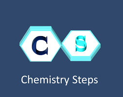
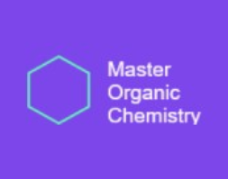

Need more practice or can’t find what you’re looking for? Check out our resource catalog for trusted organic chemistry websites and tools to help you deepen your understanding and hone your skills.

  <a href="/reactionrepo/additional-resources/chemistry-steps" class="card-link">
    

      
      

        <h5 class="card-title">Chemistry Steps</h5>
      

    

  </a>
  <a href="/reactionrepo/additional-resources/master-organic-chemistry" class="card-link">
    

      
      

        <h5 class="card-title">Master Organic Chemistry</h5>
      

    

  </a>

  <a href="/reactionrepo/additional-resources/chemist.swiswiswift/" class="card-link">
    

      
      

        <h5 class="card-title">Chemist.swiswiswift</h5>
      

    

  </a>

