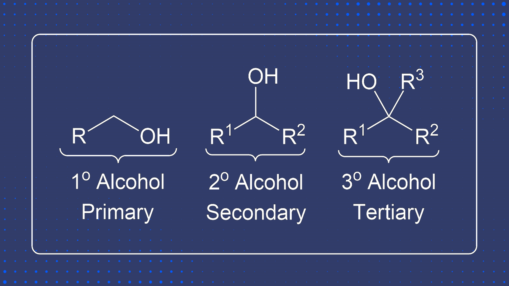
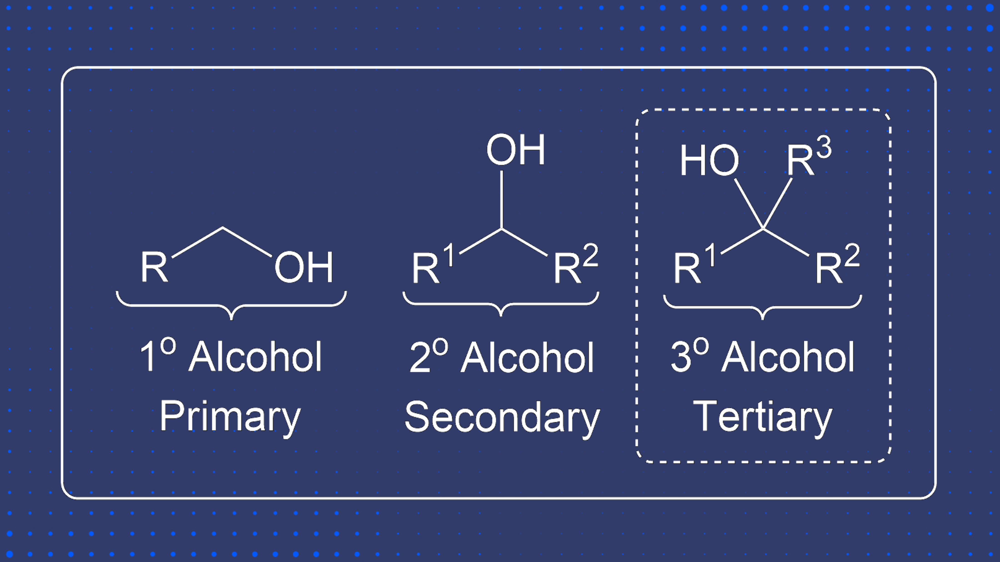
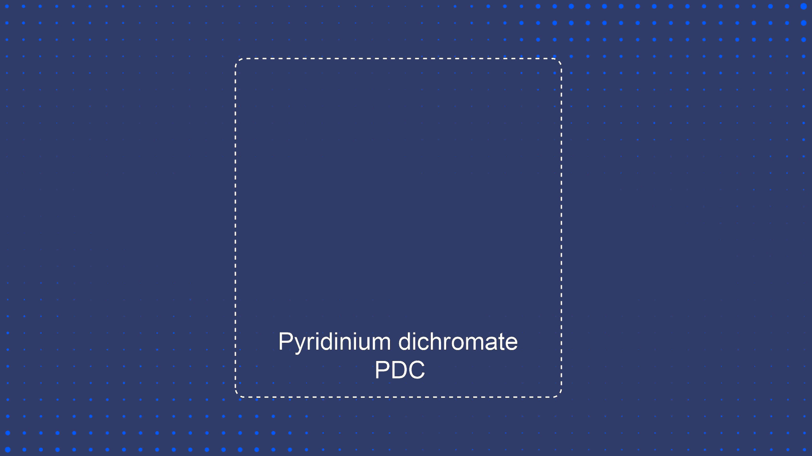
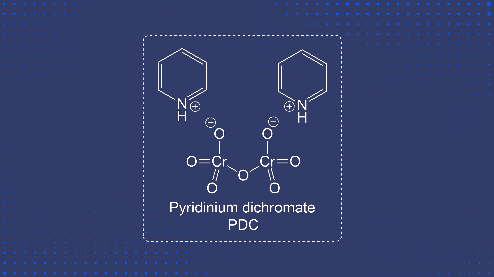
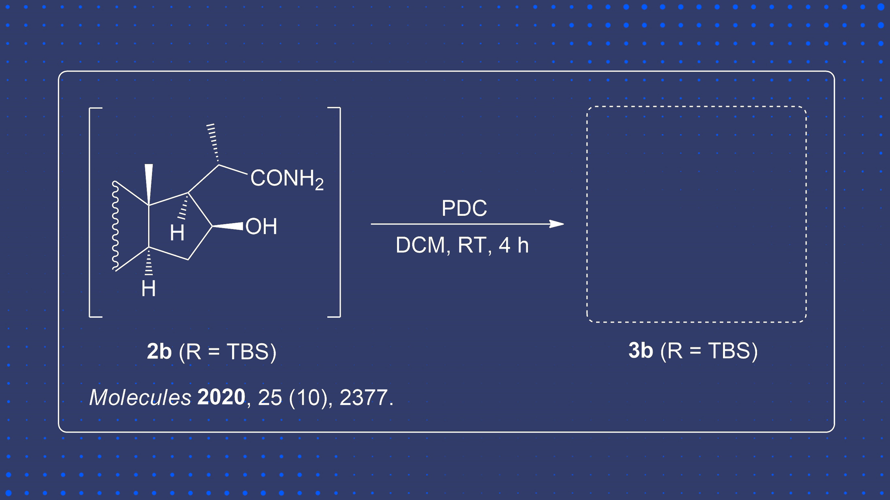
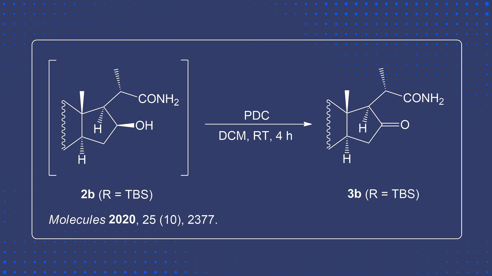
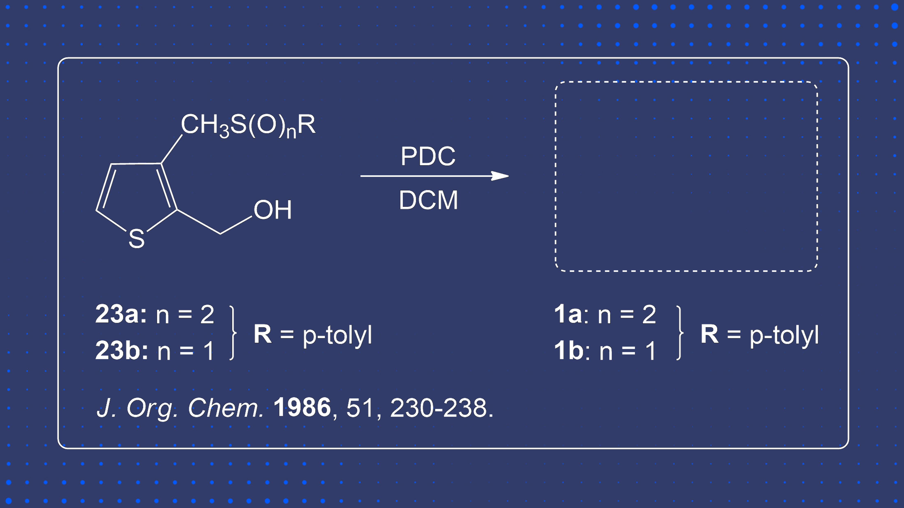
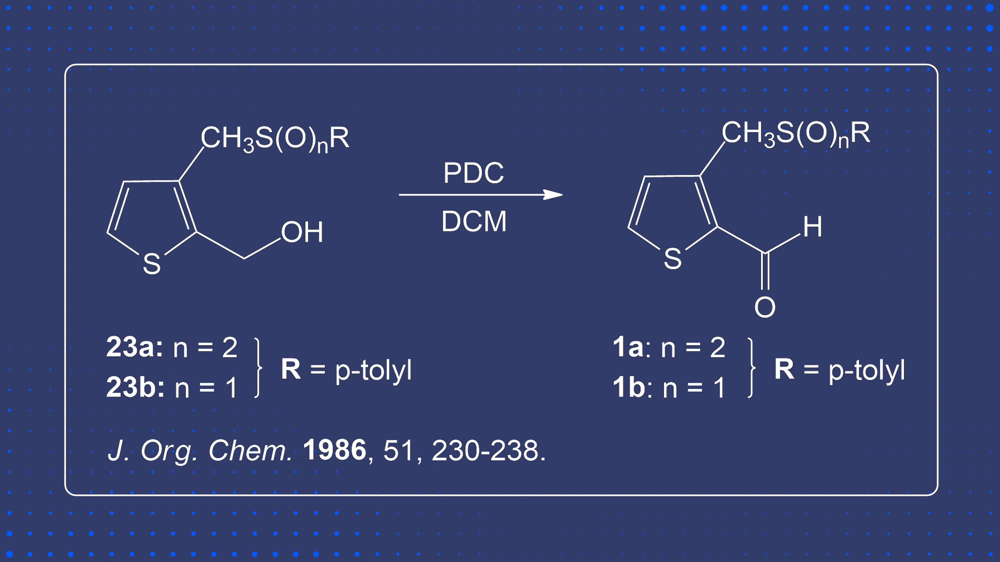


  Here you can test your knowledge on product guessing for the Corey Schmidt Oxidation without the usage of water.



  Education
  



  Hi Everyone! This section is currently a work in progress, however, we have some sample questions we would love for you to try.


</head>
<body>

## Concept Testing


  Here you can test your knowledge on concept based questions!


### Question 1


  What kind of Alcohol cannot undergo Corey Schmidt Oxidation?


  

    

      

        
      

      

        
      

    

  

  
### Question 2


  Draw the Full Pyridinium dichromate structure.


  

    

      

        
      

      

        
      

    

  

## Predict the Product


  Here you can see if you can see if you correctly guess what the product is!


### Question 1


  Predict the Product.


  

    

      

        
      

      

        
      

    

  

### Question 2


  Guess the Product.


  

    

      

        
      

      

        
      

    

  

</body>
</html>

## References

    
    
    
1. Corey, E. J.; Schmidt, G. Useful Procedures for the Oxidation of Alcohols Involving Pyridinium Dichromate in Aprotic Media. <i>Tetrahedron Lett.</i> <b>1979</b>, <i>20</i> (5), 399–402. DOI: <a href="https://doi.org/10.1016/S0040-4039(01)93515-4">10.1016/S0040-4039(01)86498-0</a>. <a href="#ref1-anchor">↩</a>

    
    
    
2. Wojtkielewicz, A.; Pawelski, D.; Bazydło, P.; Baj, A.; Witkowski, S.; Morzycki, J. W. A Convenient Synthesis of (16S,20S)-3β-hydroxy-5α-pregnane-20,16-carbolactam and its N-alkyl Derivatives. <i>Molecules</i> <b>2020</b>, <i>25</i> (10), 2377. DOI: <a href="https://doi.org/10.3390/molecules25102377">10.3390/molecules25102377</a>. <a href="#ref3-anchor">↩</a>

    
    
    
3. Terpstra, J. W.; Van Leusen, A. M. A new synthesis of benzo[b]thiophenes and benzo[c]thiophenes by annulation of disubstituted thiophenes. <i>J. Org. Chem.</i> <b>1986</b>, <i>51</i> (2), 230–238. DOI: <a href="https://doi.org/10.1021/jo00352a019">10.1021/jo00352a019</a>. <a href="#ref2a-anchor">↩</a>

