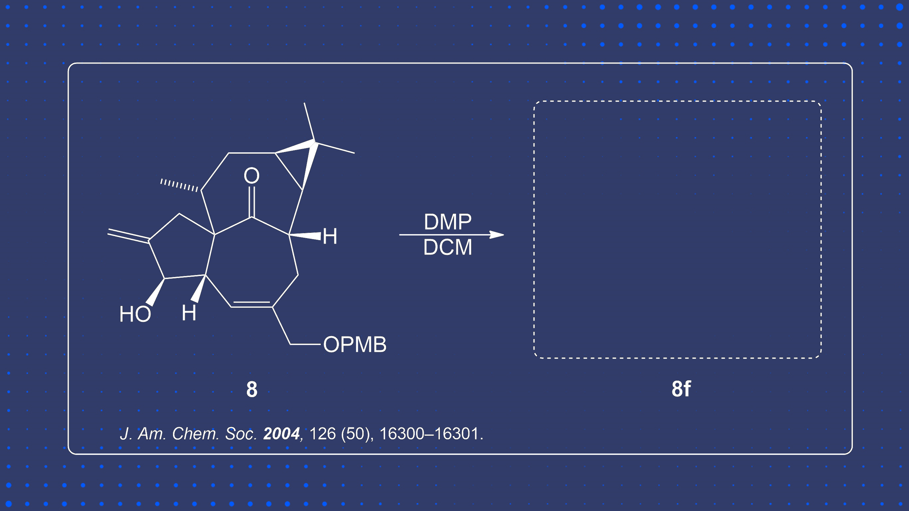


  Here you can test your knowledge on product guessing for the Dess Martin Oxidation without the usage of water.



  Hi Everyone! This section is currently a work in progress, however, we have some sample questions we would love for you to try.


</head>
<body>

## Concept Testing


  Here you can test your knowledge on concept based questions!


### Question 1


  What kind of Alcohol cannot undergo Dess Martin Oxidation?


  

    

      

        
      

      

        
      

    

  

  
### Question 2


  Draw the Full Dess-Martin Periodinane structure.


  

    

      

        
      

      

        
      

    

  

## Predict the Product


  Here you can see if you can see if you correctly guess what the product is!


### Question 1


  Predict the Product.


  

    

      

        
      

      

        
      

    

  

### Question 2


  Guess the Product.


  

    

      

        
      

      

        
      

    

  

</body>
</html>

## References

    
    
    
1. Dess, D. B.; Martin, J. C. Readily Accessible 12-I-51 Oxidant for the Conversion of Primary and Secondary Alcohols to Aldehydes and Ketones. <i>J. Org. Chem.</i> <b>1983</b>, <i>48</i>, 4155–4156. DOI: <a href="https://doi.org/10.1021/jo00356a052">10.1021/jo00356a052</a>. <a href="#ref1-anchor">↩</a>

    
    
    
2. Nickel, A.; Maruyama, T.; Tang, H.; Murphy, P. D.; Greene, B.; Yusuff, N.; Wood, J. L. Total synthesis of ingenol. <i>J. Am. Chem. Soc.</i> <b>2004</b>, <i>126</i> (50), 16300–16301. DOI: <a href="https://doi.org/10.1021/ja044123l">10.1021/ja044123l</a>. <a href="#ref1-anchor">↩</a>

    
    
    
3. Lee, K.-Y.; Kim, Y.-H.; Oh, C.-Y.; Ham, W.-H. Facile and efficient total synthesis of (+)-preussin. <i>Org. Lett.</i> <b>2000</b>, <i>2</i> (25), 4041–4042. DOI: <a href="https://doi.org/10.1021/ol000289p">10.1021/ol000289p</a>. <a href="#ref5-anchor">↩</a>

