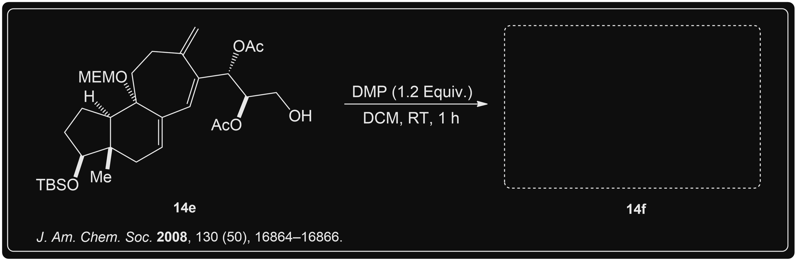
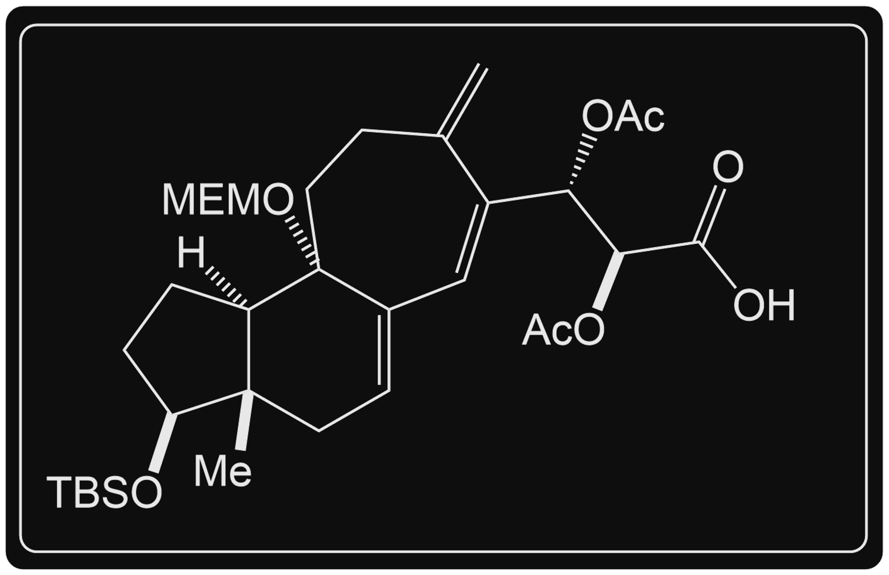
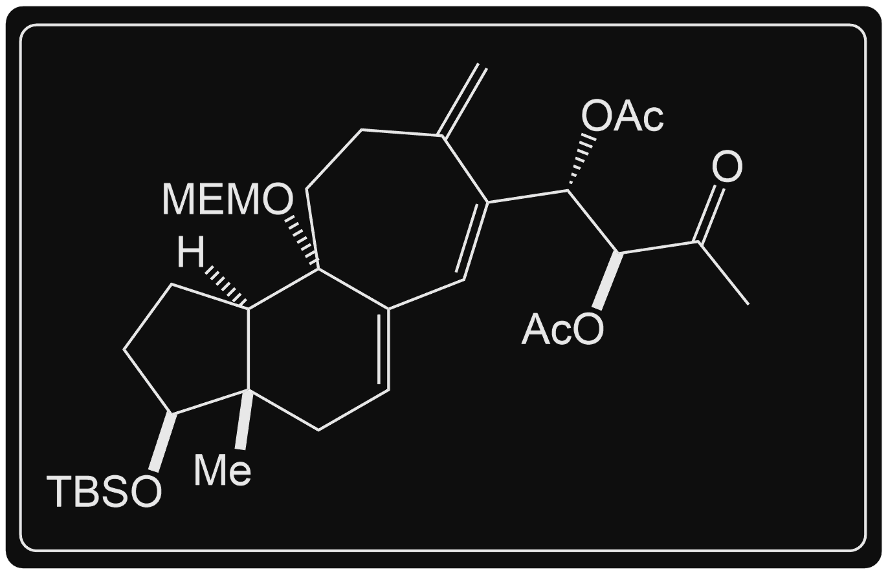
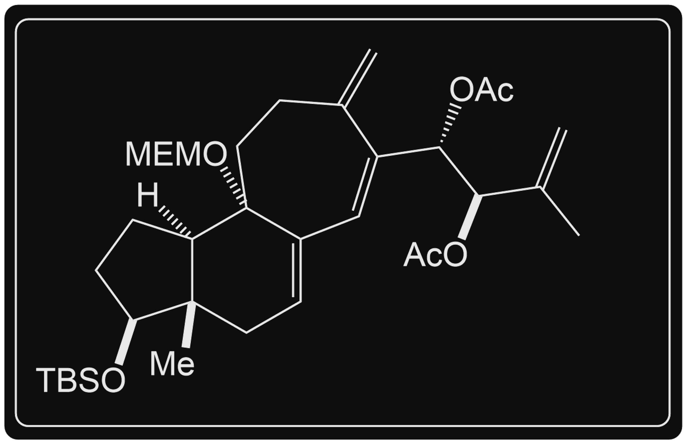
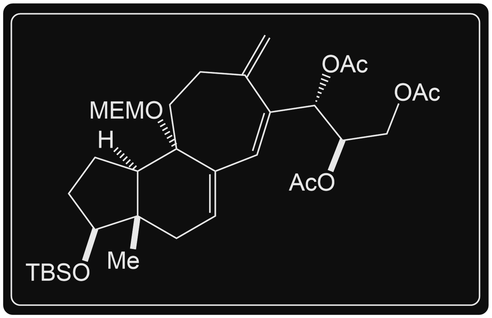
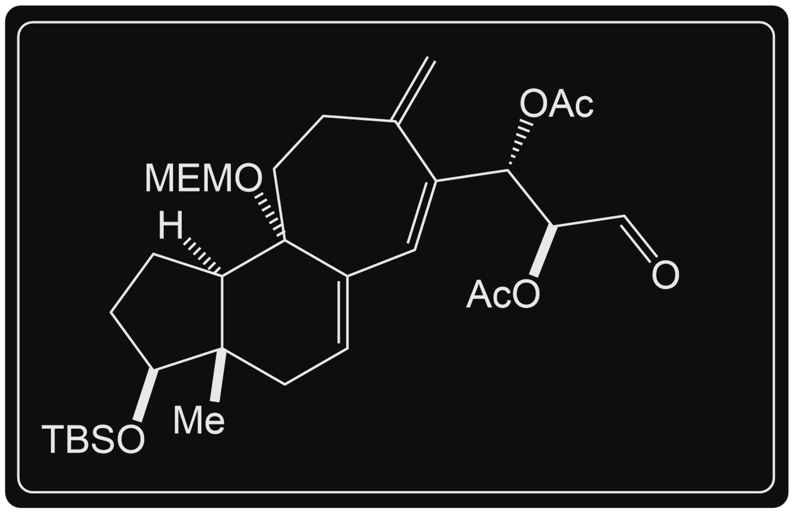


  Here you can test your knowledge on product guessing for the Dess Martin Oxidation without the usage of water.



  Hi Everyone! This section is currently a work in progress. However, we have 1 question for you to try!


## Product Quiz



---
primary_color: orange
secondary_color: '00FFFFFF'
text_color: black
shuffle_questions: false
shuffle_answers: true
---

## Determine the Missing Product

**This reaction is part of a 25 step synthesis pathway to create (+-)Cortistatin by [Lee et al. (2008)](https://pubs.acs.org/doi/10.1021/ja8071918).** **The alcohol intermediate (14e) was oxidized to create an intermediate (14f) to be further used in this pathway.** *See Reference 1*

> Primary Alcohols selectively are oxidized to Aldehydes.

- [ ] 
- [ ] 
- [ ] 
- [ ] 
- [x] 



## References

    
    
    
1. Lee, H. M.; Nieto-Oberhuber, C.; Shair, M. D. Enantioselective synthesis of (+)-cortistatin A, a potent and selective inhibitor of endothelial cell proliferation. <i>J. Am. Chem. Soc.</i> <b>2008</b>, <i>130</i> (50), 16864–16866. DOI: <a href="https://doi.org/10.1021/ja8071918">10.1021/ja8071918</a>. <a href="#ref2-anchor">↩</a>

